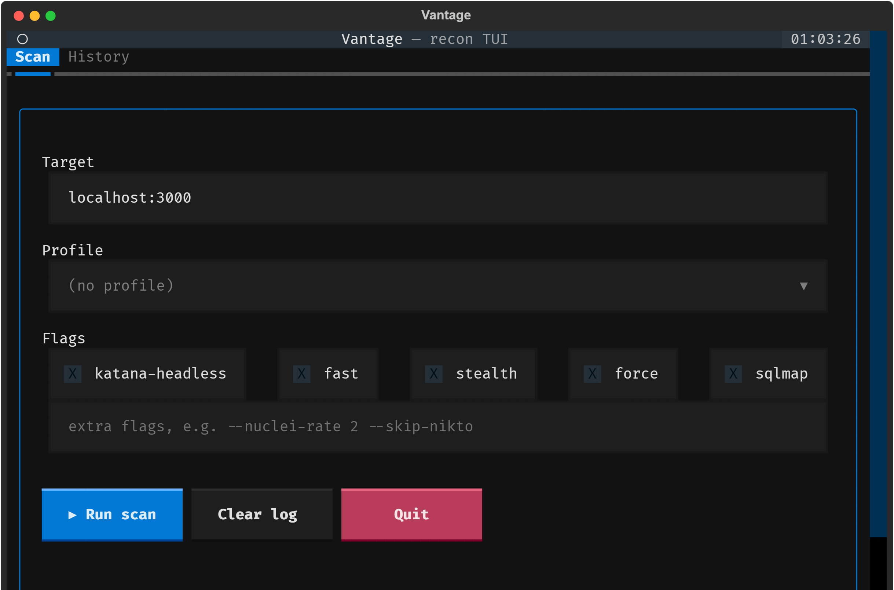

# Strix Vantage

> A recon + light-scanning **pipeline** that orchestrates ~25 industry-standard Kali
> tools into one command, streams live status to your terminal, and writes a tidy
> report. Built for sharpening web-security skills against a **local OWASP Juice Shop**,
> with an IDS/WAF-safe design and an optional terminal UI.

[](LICENSE)
[-blue.svg)](#install)
[](#-authorized-use-only)



Part of the open-source **[Strix Advanced Tools](https://github.com/strix-tool)** suite.

## ⚠️ Authorized use only

Vantage sends **active** traffic (port scans, fuzzing, vulnerability probes, optional
DAST). Run it **only** against systems you own or have **explicit written permission**
to test — e.g. your own local Juice Shop container or a lab you control. Unauthorized
scanning is illegal in most jurisdictions. **You are responsible for how you use it.**

## What it does

Give it a domain/URL and it runs, in order: subdomain enumeration → liveness → per-host
scanning (port/TLS/WAF/crawl/fuzz/vuln checks) → a formatted report. The **active** scan
set runs only on the primary (entered) target; other live hosts get a light `whatweb`
fingerprint. It speeds up by **doing less work, not hammering faster** — `--stealth`
lowers rate and adds jitter, staying IDS/WAF-friendly.

```bash
# local Juice Shop, WAF-safe everyday scan
sudo python3 vantage.py localhost:3000 --profile stealth

# discovery only, no active vuln scanning
sudo python3 vantage.py yourlab.local --profile recon
```

See the full flag/profile reference in [docs/ORIGINAL_README.md](docs/ORIGINAL_README.md).

## Install

Built for **Kali Linux** (Python 3 is preinstalled). On first run Vantage can
auto-install missing tools — this is now **opt-in and warned** (see Security). Prefer
installing tools yourself from your distro's signed packages:

```bash
sudo apt install -y golang-go nodejs npm      # helpers for a few tools
git clone https://github.com/strix-tool/strix-vantage
cd strix-vantage
sudo python3 vantage.py --version             # Vantage 2.2
```

Optional terminal UI:

```bash
pip install textual --break-system-packages
sudo python3 vantage_tui.py
```

## Security (of the tool itself)

Vantage is hardened against turning your own box into a foothold:

- **No shell** — every tool is run with an argument list (`subprocess.run([...])`), so a
  crafted target can't inject commands.
- **Opt-in auto-install** — installing tools from the internet as root now prints a
  supply-chain warning and (when interactive) asks for confirmation; npm runs with
  `--ignore-scripts`; use `--no-install` to skip entirely.
- **PATH-hijack guard** — when running as root, user-writable directories are refused
  from `PATH`.
- **Bounded secret scan** — capped fetches + a non-backtracking email regex, so a hostile
  target page can't hang the run.

Full details and the threat model: [SECURITY.md](SECURITY.md).

## Credits

Vantage is an **orchestrator** — it does not bundle or modify any scanner; it invokes
each as a separate program you install. Enormous thanks to every upstream project. Full
list with authors, links, and licenses: **[ACKNOWLEDGEMENTS.md](ACKNOWLEDGEMENTS.md)**.

## License

[MIT](LICENSE) © 2026 Strix Advanced Tools. The integrated tools remain under their own
licenses. Use only where you are authorized.
